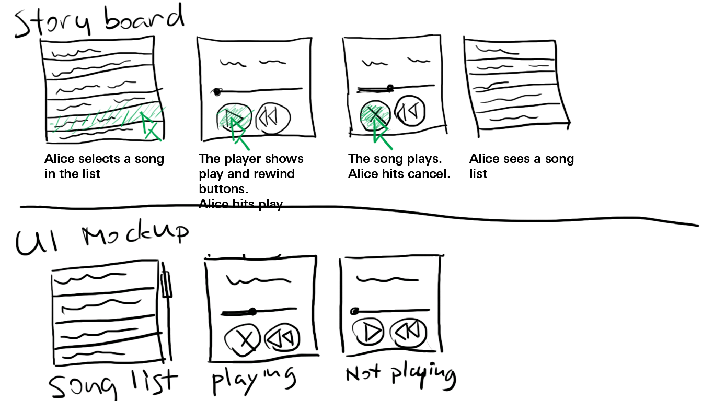
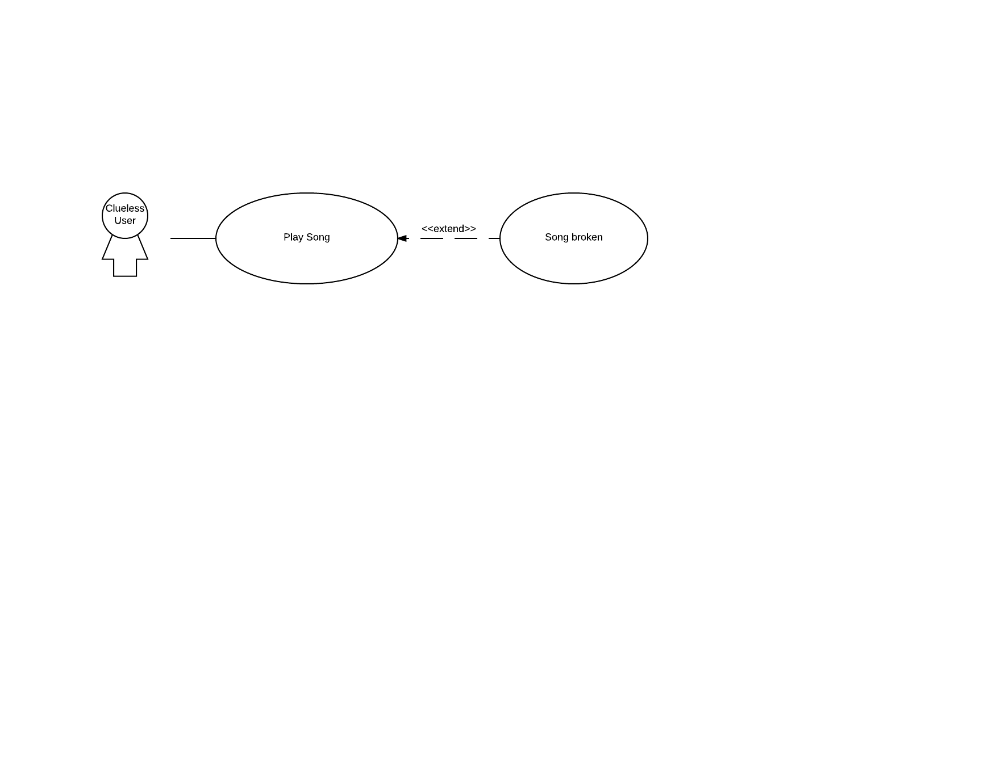

# CS3733 Assignment 1 Keshuai Xu

# Part 1

## 1. Epic

A music player with play, rewind, and list functionalities.

## 2. User stories

As a user, I want to play music when I hit play button so I can listen to music.

As a user, I want to jump back to the beginning of the current song so I can hear it again.

## 3. Storyboard + 4. ui mockup



# Use case

## 1. Scenario

Alice is a music player user. She is listening music. She finds a song currently playing interesting. She hits rewind button. The current song plays from beginning.

## 2. Textual use cases
```yaml
Name: Play
Participating actor: User
Entry condition: 
    a song selected. 
Exit condition:
    Song playing
Flow of events:
    Play button hit.
    Song plays.
Alternate Flow of Events: Song broken
Special Requirement: None
```
```yaml
Name: Rewind
Participating actor: User
Entry condition: 
    a song selected. 
Exit condition:
    Song playing from beginning
Flow of events:
    Rewind button hit.
    Song rewinds to beginning and plays.
Alternate Flow of Events: None
Special Requirement: None
```
```yaml
Name: Cancel
Participating actor: User
Entry condition: 
    a song playing. 
Exit condition:
    showing song list
Flow of events:
    Cancel button hit.
    shows song list
Alternate Flow of Events: None
Special Requirement: None
```
## 3. use case diagram


